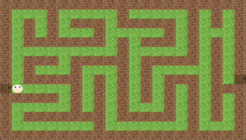

# Maze Game!!!

A friendly maze game totally built in JavaScript, HTML5 and CSS3.
Our main character was built entirely in css, use the arrow keys ⬆️⬇️➡️⬅️ to move him to the exit of the maze.
Press the "space" key to see a special moviment!

The maze is a 2D array of cells that represent the floor (passable) or walls (impassable).

GitHub Pages link: [https://wagnerfabricio.github.io/labirinto-js-wagnerfabricio/](https://wagnerfabricio.github.io/labirinto-js-wagnerfabricio/)


This JavaScript represents the maze described above. Each "W" represents a wall, "S" the starting position and "F" the finish line. Spaces are empty cells where the player can move.

```js
const map = [
  "WWWWWWWWWWWWWWWWWWWWW",
  "W   W     W     W W W",
  "W W W WWW WWWWW W W W",
  "W W W   W     W W   W",
  "W WWWWWWW W WWW W W W",
  "W         W     W W W",
  "W WWW WWWWW WWWWW W W",
  "W W   W   W W     W W",
  "W WWWWW W W W WWW W F",
  "S     W W W W W W WWW",
  "WWWWW W W W W W W W W",
  "W     W W W   W W W W",
  "W WWWWWWW WWWWW W W W",
  "W       W       W   W",
  "WWWWWWWWWWWWWWWWWWWWW",
];
```

<td valign="top" width="33%">

## Images:

<div align="center">




</div>
</td>

<td valign="top" width="33%">

### Techs:

<div align="center">


</div>

</td>
